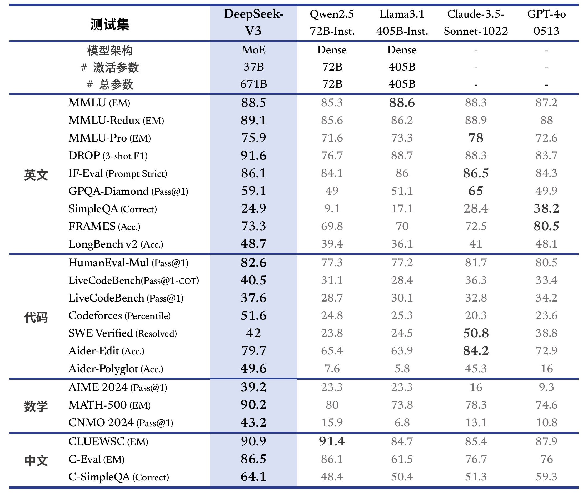

# TextEvaluation
A simple text classification/summarization tool

## How to use

1. Clone the repository
```bash
git clone https://github.com/Evi0ned/TextEvaluation.git
cd TextEvaluation
```
2. Install the requirements
```bash
pip install -r requirements.txt
```
3. Fill in the secrets.py with your API key
```python
api_key = ""
base_url="https://api.sambanova.ai/v1"
model="DeepSeek-V3-0324"
```
We recommend using the `DeepSeek-V3-0324` model for text summarization tasks. This model has significant advantages over other models in dealing with long context projects. In the long context evaluation, on DROP, FRAMES and LongBench v2, DeepSeek-V3 outperformed other models on average. Meanwhile, its usage cost is relatively low, and the speed of generating text is much higher than that of other models. So we decided to use this model.

You can also use other models, but you may need to adjust the parameters in the `secrets.py` file.

4. Run the script
```bash
uvicorn main:app --reload
```
5. Open the frontend page and use the tool!

## Result


## How to improve this system
1. Try to use different prompt techniques such as few-show prompting, chain-of-thought and self-polish algorithm.
2. Choose better models. We are using the `DeepSeek-V3-0324` model, but other models may be better for this task. For example, we have tried `Meta-Llama-3.1-8B-Instruct` model, but it is not as good as `DeepSeek-V3-0324` model in this task. You can try other models and see if they work better for you.
3. Design better prompts. The current prompt is a simple prompt, but we can design better prompts to improve the performance of the model. 


Hint: SambaNova is free for users, you can register one and test it, or use your own API key.